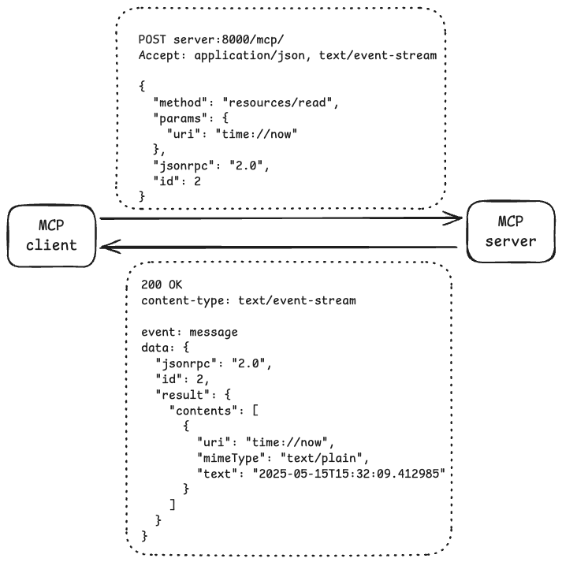

# MCP Client-Server Demo

Basic demo of MCP client-server model using streamable HTTP as the transport protocol, created with the [MCP Python SDK](https://github.com/modelcontextprotocol/python-sdk).

This is also built for the purpose of understanding the mesages flows between MCP client and server, e.g. the diagram below shows the messages exchanged when the client reads a resource on the server. More message exchanges between client and server can be found [here](./docs/messages.md).



## Demo Instructions

Use docker to spin up the MCP server and client

```
docker compose build
docker compose up
```

You should see the output as such

```
server-1  | INFO:     172.22.0.3:55598 - "POST /mcp/ HTTP/1.1" 200 OK
server-1  | INFO:     172.22.0.3:55610 - "POST /mcp/ HTTP/1.1" 202 Accepted
server-1  | INFO:     172.22.0.3:55624 - "POST /mcp/ HTTP/1.1" 200 OK
server-1  | [05/15/25 05:08:57] INFO     Processing request of type            server.py:545
server-1  |                              ListResourcesRequest
server-1  | INFO:     172.22.0.3:55628 - "POST /mcp/ HTTP/1.1" 200 OK
server-1  |                     INFO     Processing request of type            server.py:545
server-1  |                              ReadResourceRequest
server-1  | INFO:     172.22.0.3:55630 - "POST /mcp/ HTTP/1.1" 200 OK
server-1  | [05/15/25 05:08:58] INFO     Processing request of type            server.py:545
server-1  |                              ListResourceTemplatesRequest
server-1  | INFO:     172.22.0.3:55642 - "POST /mcp/ HTTP/1.1" 200 OK
server-1  |                     INFO     Processing request of type            server.py:545
server-1  |                              ReadResourceRequest
server-1  | INFO:     172.22.0.3:55656 - "POST /mcp/ HTTP/1.1" 200 OK
server-1  | [05/15/25 05:08:59] INFO     Processing request of type            server.py:545
server-1  |                              ListToolsRequest
server-1  | INFO:     172.22.0.3:55670 - "POST /mcp/ HTTP/1.1" 200 OK
server-1  |                     INFO     Processing request of type            server.py:545
server-1  |                              CallToolRequest
client-1  | Connecting to server at http://server:8000/mcp/...
client-1  |
client-1  | # List resources
client-1  | Found 1 resource(s): ['time://now']
client-1  | Current time: 2025-05-15T05:08:57.576683
client-1  |
client-1  | # Get resource template
client-1  | Found 1 resource template(s): ['get_user_id']
client-1  | John's ID: 4a6f686e
client-1  |
client-1  | # Call tool
client-1  | Found 1 tool(s): ['to_upper_case']
client-1  | Converting 'hello' to upper case: HELLO
client-1  |
client-1  | Bytecode compiled 947 files in 363ms
```

## Development

### Prerequisite

- [uv](https://github.com/astral-sh/uv)

Setup the Python execution environment
```
uv sync
source .venv/bin/activate
```

### Instructions

Start the MCP server
```
uv run src/server.py
```

In a separate terminal, run the MCP client
```
uv run src/client.py
```

You should see
```
# List resources
Found 1 resource(s): ['users://names']
Users: ['alice', 'bob', 'charlie', 'dave', 'eve']

# Get resource template
Found 1 resource template(s): ['get_user_id']
John's ID: 4a6f686e

# Call tool
Found 1 tool(s): ['to_upper_case']
Converting 'hello' to upper case: HELLO
```


## Project bootstrap

> This section can be safely ignored, and is only here for project bootstrap documentation purposes

```
uv venv
source .venv/bin/activate
uv init
uv add "mcp[cli]"
```
